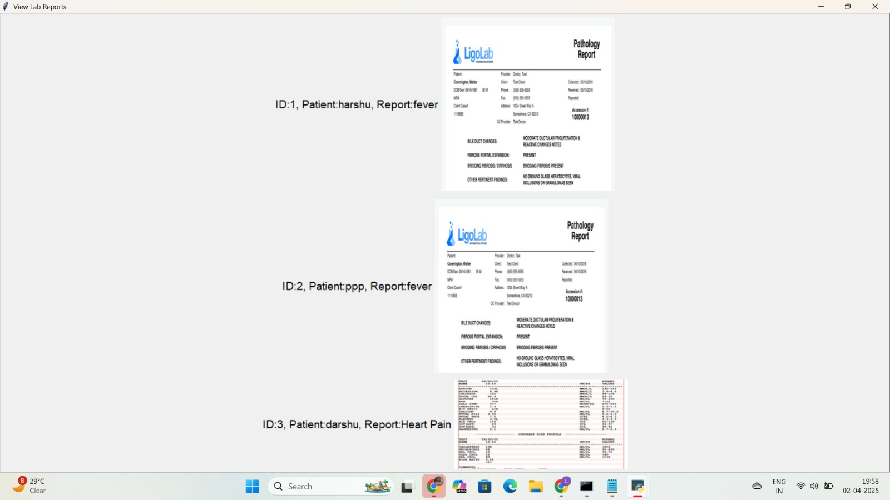
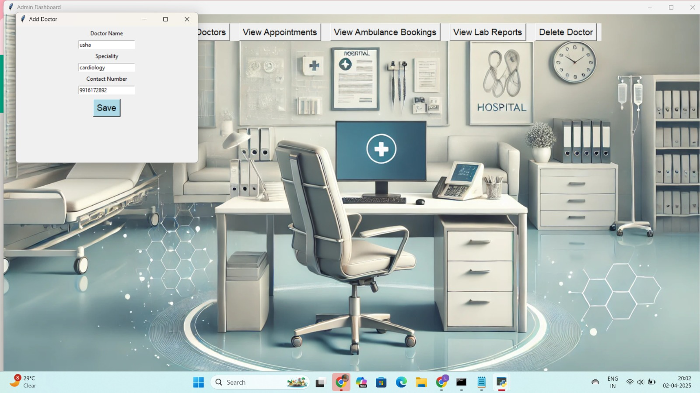

# 🏥 Hospital Management System

A Desktop-Based Hospital Management System developed using Python and Tkinter.  
This application helps manage hospital operations such as patient registration, doctor management, and appointment scheduling with automatic data storage using SQLite.

---

## 📌 Project Overview

The Hospital Management System is designed to simplify hospital administrative tasks through a user-friendly graphical interface.  
All data is stored locally using SQLite database without requiring any external backend server.

---

## 🔧 Technologies Used

- Python 3.x
- Tkinter (Graphical User Interface)
- SQLite (Database)
- Tkcalendar
- Pillow (Image Handling)

---

## ✨ Key Features

- 🔐 Admin Login System
- 👨‍⚕️ Doctor Management (Add, View, Delete)
- 🧑‍🤝‍🧑 Patient Registration
- 📅 Appointment Scheduling
- 📞 Contact Information Storage
- 🗄️ Automatic Data Storage using SQLite
- 🖥️ Clean and User-Friendly Interface

---

## 🗄️ Database Details

- SQLite database (.db file)
- Data stored locally
- No external backend required
- Secure and efficient data handling

---

## 🚀 How to Run the Project

### Step 1: Install Python
Download and install Python (3.x)

### Step 2: Install Required Libraries
Open Command Prompt and run:

pip install tkcalendar pillow

### Step 3: Run the Application
Navigate to the project folder and run:

python app.py

---

## 📂 Project Structure

```
## 📂 Project Structure

```
Hospital-management-system/
│
├── app.py
├── database.py
├── utils.py
├── assets/
├── images/
│   ├── image1.png.jpeg
│   ├── image2.png.jpeg
│   ├── image3.png.jpeg
│   ├── ...
│   └── image13.png.jpeg
├── hospital.db
└── README.md
```

---

## 🎯 Project Type

MCA Academic Project – Desktop Application

This project demonstrates GUI development and database integration using Python and SQLite.

---

## 👩‍💻 Developed By

Lakshmitha D  
MCA Graduate
---

---

## 📸 Application Screenshots

<p align="center">
  
  
  
  
  
  
  
  
  
  
  
  
  
</p>
